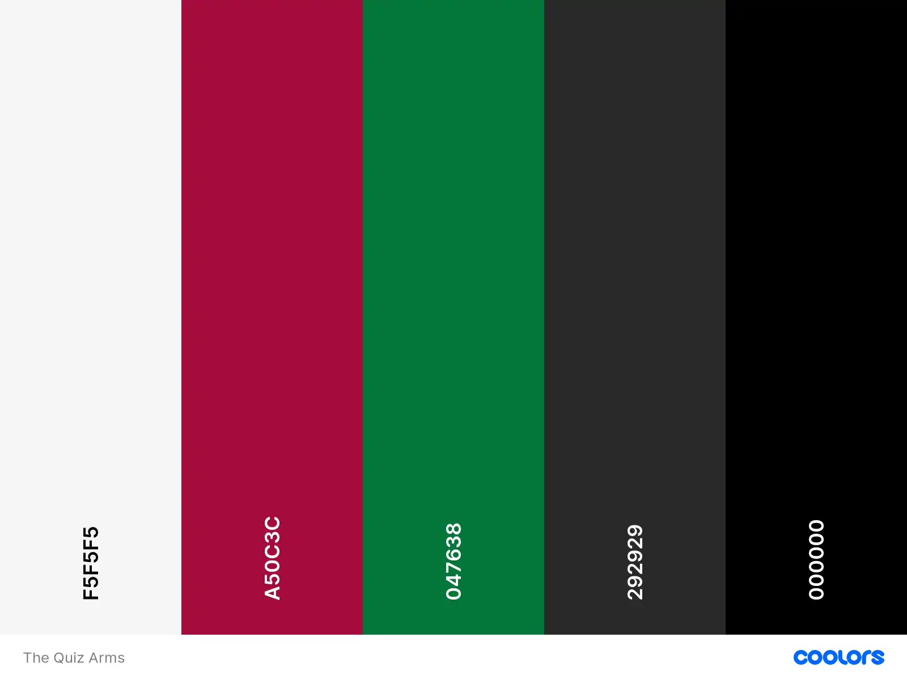
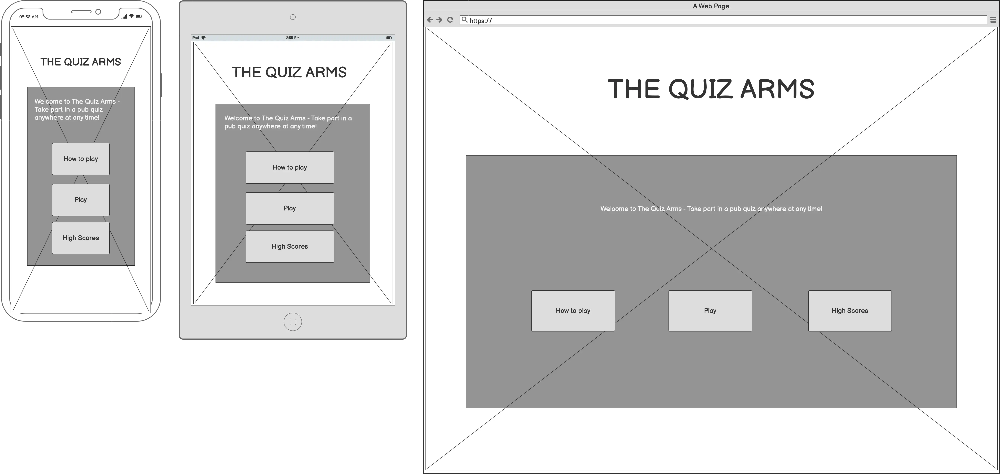
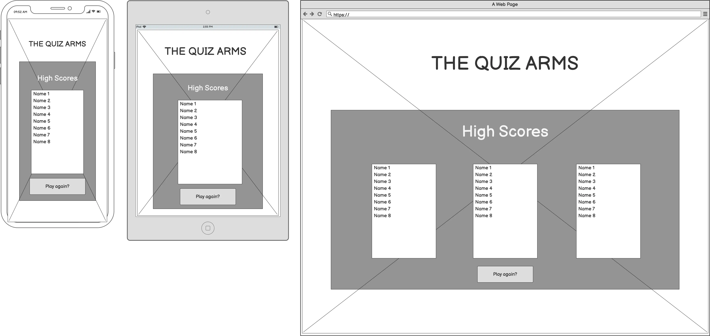

# The Quiz Arms

Test your general knowledge and get pub quiz ready!

Add site responsive screenshot here

View the deployed site here: [The Quiz Arms](https://kera-cudmore.github.io/TheQuizArms/)

## CONTENTS

* [User Experience (UX)](#User-Experience-(UX))
  * [Initial Idea](#Initial-Idea)
  * [User Stories](#User-Stories)

* [Design](#Design)
  * [Colour Scheme](#Colour-Scheme)
  * [Typography](#Typography)
  * [Imagery](#Imagery)
  * [Wireframes](#Wireframes)
  * [Features](#Features)
  * [Accessibility](#Accessibility)

* [Technologies Used](#Technologies-Used)
  * [Languages Used](#Languages-Used)
  * [Frameworks, Libraries & Programs Used](#Frameworks,-Libraries-&-Programs-Used)

* [Deployment & Local Development](#Deployment-&-Local-Development)
  * [Deployment](#Deployment)
  * [Local Development](#Local-Development)
    * [How to Fork](#How-to-Fork)
    * [How to Clone](#How-to-Clone)

* [Testing](#Testing)
  * [W3C Validator](#W3C-Validator)
  * [JavaScript Validator](#JavaScript-Validator)
  * [Solved Bugs](#Solved-Bugs)
  * [Known Bugs](#Known-Bugs)
  * [Testing User Stories](#Testing-User-Stories)
  * [Lighthouse](#Lighthouse)
  * [Full Testing](#Full-Testing)
  
* [Credits](#Credits)
  * [Code Used](#Code-Used)
  * [Content](#Content)
  * [Media](#Media)
  * [Acknowledgments](#Acknowledgments)

- - -

## User Experience (UX)

### Initial Idea

Pub Quizzes are played all around the world, but they are especially popular in the UK. It is estimated that over half the pubs in the UK host a regular quiz night, thats roughly 23,600 pubs!

[YouGov](https://yougov.co.uk/topics/lifestyle/explore/activity/Pub_quizzes) show that 98% of people surveyed have heard of a pub quiz, and are rated as the 19th most popular social activity.

During lockdowns pub quizzes remained popular - they just changed format to become virtual. This gave me the idea of creating a quiz site that would feel like a pub quiz, where users could play on their own to improve their general knowledge anywhere and at any time.

### User Stories

#### First Time Visitor Goals

* I want to take part in a pub quiz online and improve my general knowledge. I want to be able to play at any time, anywhere.
* I want the site to be responsive to my device.
* I want the site to be easy to navigate.

#### Returning Visitor Goals

* I want to be able to choose a level of difficulty that I feel is appropriate for me, based on my experience from my first visit to the site.

#### Frequent Visitor Goals

* I want to be able to adjust the difficulty level to keep improving my knowledge.
* I want to be able to log my high scores to see how I am performing.

- - -

## Design

### Colour Scheme

As the pages of the site have a background image, I wanted to keep the colour scheme used on the site quite small so as to not overwhelm users. Red and green  are very typical colours in traditional British public houses, with the red & green used for upholstery.

* I have used #f5f5f5 & #000000 as the primary and secondary colours used for the sites text.
* I have used #292929 as the overlay used over the sites background image.
* I have used # a50c3c for the border of the modal and to display the wrong answers.
* I have used #047638 to display the correct answer.

### Typography

Google Fonts was used to import the chosen fonts for use in the site.

* For the Page Title I have used the google font [Almendra](https://fonts.google.com/specimen/Almendra?preview.text=The%20Quiz%20Arms%20THE%20QUIZ%20ARMS&preview.text_type=custom&query=almendra). Almendra is based on a calligraphy style and I have chosen it as it looks like the type of font you would see on a pubs name sign, slightly medieval looking and grand.

* For the body of the page I have used the google font [Quicksand](https://fonts.google.com/specimen/Quicksand?preview.text=The%20Quiz%20Arms%20THE%20QUIZ%20ARMS&preview.text_type=custom&query=quicksand). QuickSand is a sans-serif font which has lovely clean lines. I have chosen to use a sans-serif font for the body of the page as studies have found that sans-serif fonts are generally more legible to read on a screen.

### Imagery

As the website is called The Quiz Arms, I wanted to use an image for the page background of a pub to give the user the feeling that they are participating in a pub quiz.

### Wireframes

Wireframes were created for mobile, tablet and desktop using balsamiq.

### Features

The website is comprised of a home page, a games page, a high scores page and a 404 error page.

All Pages on the website have:

* A favicon in the browser tab. 

Future Implementations.

* In future implementations I would like to give the user of the site more choice as to how many questions are in their quiz.

### Accessibility

I have been mindful during coding to ensure that the website is as accessible friendly as possible. This has been have achieved by:

* Using semantic HTML.
* Using descriptive alt attributes on images on the site.
* Providing information for screen readers where there are icons used and no text.
* Ensuring that there is a sufficient colour contrast throughout the site.

- - -

## Technologies Used

### Languages Used

HTML, CSS, Javascript

### Frameworks, Libraries & Programs Used

* [Balsamiq](https://balsamiq.com/) - Used to create wireframes.

* [Git](https://git-scm.com/) - For version control.

* [Github](https://github.com/) - To save and store the files for the website.

* [GitPod](https://gitpod.io/) - IDE used to create the site.

* [Google Fonts](https://fonts.google.com/) - To import the fonts used on the website.

* [Font Awesome](https://fontawesome.com/) - For the iconography on the website.

* [jQuery](https://jquery.com/) - A JavaScript library.

* [Google Developer Tools](https://developers.google.com/web/tools) - To troubleshoot and test features, solve issues with responsiveness and styling.

* [Birme](https://www.birme.net/) To resize images and convert to webp format.

* [Favicon.io](https://favicon.io/) To create favicon.

* [Am I Responsive?](http://ami.responsivedesign.is/) To show the website image on a range of devices.

* [Shields.io](https://shields.io/) To add badges to the README

* [Open Trivia DataBase](https://opentdb.com/) - API used for the trivia questions.

* [JSON Formatter](https://chrome.google.com/webstore/detail/json-formatter/bcjindcccaagfpapjjmafapmmgkkhgoa) - a google chrome extension to enable you to view JSON as raw data or parsed.

- - -

## Deployment & Local Development

### Deployment

The site is deployed using GitHub Pages - [The Quiz Arms](https://kera-cudmore.github.io/TheQuizArms/).

To Deploy the site using GitHub Pages:

1. Login (or signup) to Github.
2. Go to the repository for this project, [kera-cudmore/TheQuizArms](https://github.com/kera-cudmore/TheQuizArms).
3. Click the settings button.
4. Select pages in the left hand navigation menu.
5. From the source dropdown select main branch and press save.
6. The site has now been deployed, please note that this process may take a few minutes before the site goes live.

### Local Development

#### How to Fork

To fork the repository:

1. Log in (or sign up) to Github.
2. Go to the repository for this project, [kera-cudmore/TheQuizArms](https://github.com/kera-cudmore/TheQuizArms)
3. Click the Fork button in the top right corner.

#### How to Clone

To clone the repository:

1. Log in (or sign up) to GitHub.
2. Go to the repository for this project, [kera-cudmore/TheQuizArms](https://github.com/kera-cudmore/TheQuizArms)
3. Click on the code button, select whether you would like to clone with HTTPS, SSH or GitHub CLI and copy the link shown.
4. Open the terminal in your code editor and change the current working directory to the location you want to use for the cloned directory.
5. Type 'git clone' into the terminal and then paste the link you copied in step 3. Press enter.

- - -

## Testing

Testing was ongoing throughout the entire build. I utilised Chrome developer tools while building to pinpoint and troubleshoot any issues as I went along.

### W3C Validator

[W3C](https://validator.w3.org/) was used to validate the HTML on all pages of the website. It was also used to validate the CSS.

W3C validator images or links to go here

### JavaScript Validator

[jshint](https://jshint.com/) was used to validate the JavaScript.

jshint images or links to go here

### Solved Bugs

| Bug | How I solved the issue |
| :--- | :--- |
| text here | text here |

### Known Bugs

### Testing User Stories

* First Time Visitors

* Returning Visitors

* Frequent Visitors

### Lighthouse

I used Lighthouse within the Chrome Developer Tools to test the performance, accessibility, best practices and SEO of the website.

### Full Testing

To fully test my website I performed the following testing using a number of browsers (google chrome) and devices (Macbook Pro 14 inch, iPhone X, iPhone 11 pro, iPhone 13 pro).

I also went through each page using google chrome developer tools to ensure that they were responsive on all different screen sizes.

- - -

## Credits

### Code Used

### Content

### Media

[Page background image of a pub](https://pixabay.com/photos/bar-pub-cafe-establishment-stools-2209813/)

### Acknowledgments

I would like to acknowledge the following people who helped me along the way in completing this project:

* Adegbenga  Adeye - My Code Institute Mentor.
