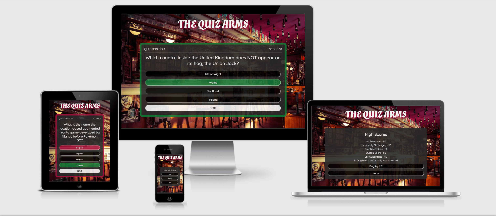
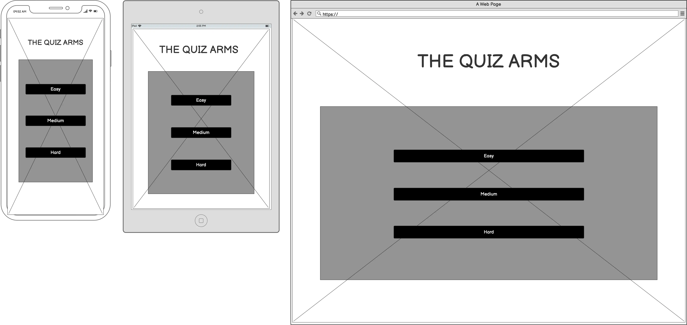
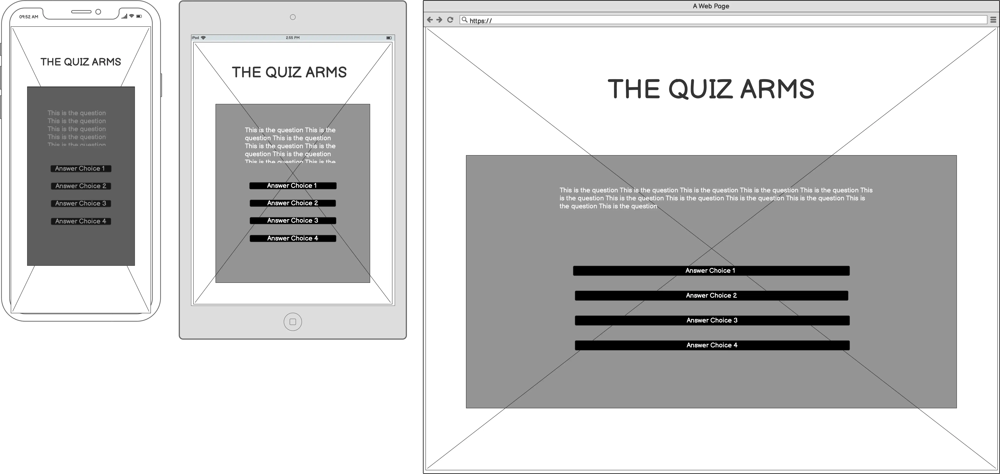
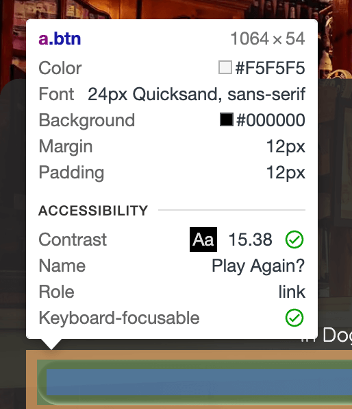
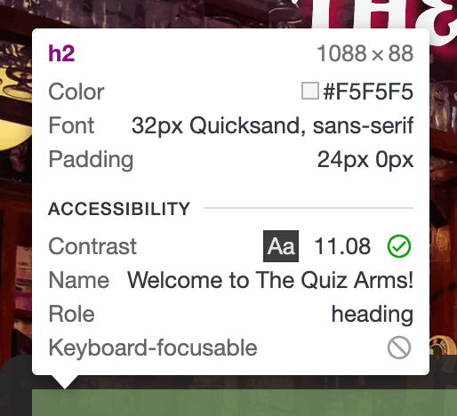
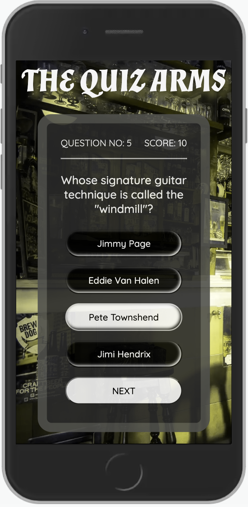
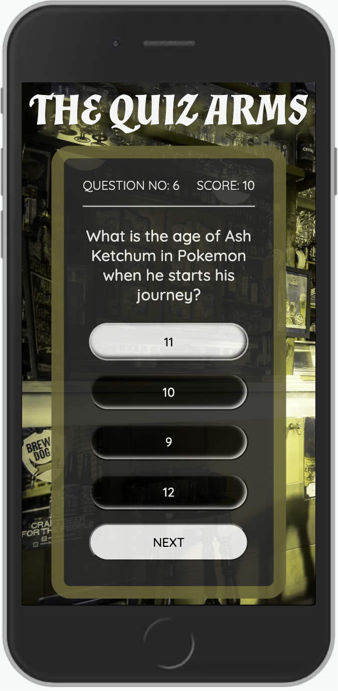
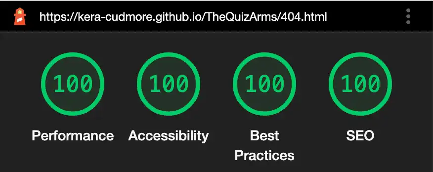
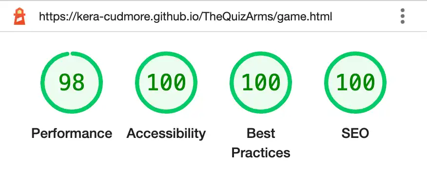
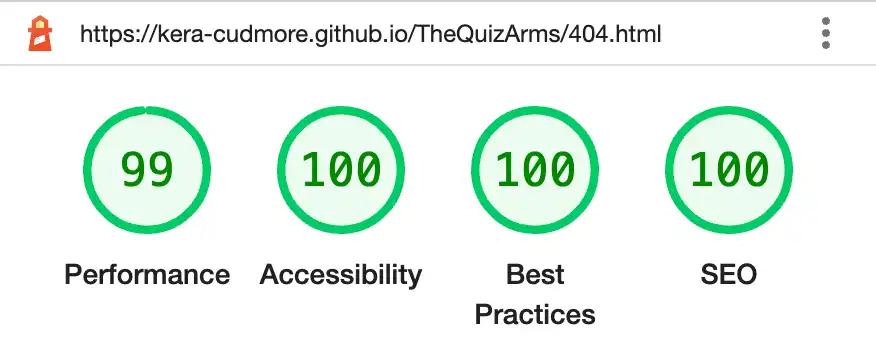

# The Quiz Arms

Visit the deployed site: [The Quiz Arms](https://kera-cudmore.github.io/TheQuizArms/)

Test your general knowledge and get pub quiz ready!

Pub Quizzes are played all around the world, but they are especially popular in the UK. It is estimated that over half the pubs in the UK host a regular quiz night, thats roughly 23,600 pubs!

[YouGov](https://yougov.co.uk/topics/lifestyle/explore/activity/Pub_quizzes) show that 98% of people surveyed have heard of a pub quiz, and are rated as the 19th most popular social activity.

During lockdowns pub quizzes remained popular - they just changed format to become virtual. This gave me the idea of creating a quiz site that would feel like a pub quiz, where users could play on their own to improve their general knowledge anywhere and at any time.

## CONTENTS

* [User Experience](#User-Experience)
  * [User Stories](#User-Stories)

* [Design](#Design)
  * [Colour Scheme](#Colour-Scheme)
  * [Typography](#Typography)
  * [Imagery](#Imagery)
  * [Wireframes](#Wireframes)
  * [Features](#Features)
    * [The Home Page](#The-Home-Page)
    * [The Game Page](#The-Game-Page)
    * [The High Scores Page](#The-High-Scores-Page)
    * [The 404 Error Page](#The-404-Error-Page)
    * [Fututre Implementations](#Future-Implementations)
  * [Accessibility](#Accessibility)

* [Technologies Used](#Technologies-Used)
  * [Languages Used](#Languages-Used)
  * [Frameworks, Libraries & Programs Used](#Frameworks,-Libraries-&-Programs-Used)

* [Deployment & Local Development](#Deployment-&-Local-Development)
  * [Deployment](#Deployment)
  * [Local Development](#Local-Development)
    * [How to Fork](#How-to-Fork)
    * [How to Clone](#How-to-Clone)

* [Testing](#Testing)
  * [W3C Validator](#W3C-Validator)
  * [JavaScript Validator](#JavaScript-Validator)
  * [Solved Bugs](#Solved-Bugs)
  * [Known Bugs](#Known-Bugs)
  * [Testing User Stories](#Testing-User-Stories)
  * [Lighthouse](#Lighthouse)
  * [Full Testing](#Full-Testing)
  
* [Credits](#Credits)
  * [Code Used](#Code-Used)
  * [Content](#Content)
  * [Media](#Media)
  * [Acknowledgments](#Acknowledgments)

- - -

## User Experience (UX)

### User Stories

#### First Time Visitor Goals

* I want to take part in a pub quiz online and improve my general knowledge. I want to be able to play at any time, anywhere.
* I want the site to be responsive to my device.
* I want the site to be easy to navigate.

#### Returning Visitor Goals

* I want to be able to choose a level of difficulty that I feel is appropriate for me, based on my experience from my first visit to the site.

#### Frequent Visitor Goals

* I want to be able to adjust the difficulty level to keep improving my knowledge.
* I want to be able to log my high scores to see how I am performing.

- - -

## Design

### Colour Scheme

As the pages of the site have a background image, I wanted to keep the colour scheme used on the site quite small so as to not overwhelm users. Red and green  are very typical colours in traditional British public houses, with the red & green used for upholstery.

In my css file I have used variables to declare colours, and then used these throughout the css file. I was recently introduced to this method during a hackathon - it is a useful convention to use as it allows you to alter the colour throughout the website if you decide to update a colour, by changing the colour once in the variable.

* I have used `#f5f5f5` & `#000000` as the primary and secondary colours used for the sites text.
* I have used `#292929` as the overlay used over the sites background image.
* I have used `#a50c3c` for the border of the modal and to display the wrong answers.
* I have used `#047638` to display the correct answer.

  

### Typography

Google Fonts was used to import the chosen fonts for use in the site.

* For the Page Title I have used the google font [Almendra](https://fonts.google.com/specimen/Almendra?preview.text=The%20Quiz%20Arms%20THE%20QUIZ%20ARMS&preview.text_type=custom&query=almendra). Almendra is based on a calligraphy style and I have chosen it as it looks like the type of font you would see on a pubs name sign, slightly medieval looking and grand.

* For the body of the page I have used the google font [Quicksand](https://fonts.google.com/specimen/Quicksand?preview.text=The%20Quiz%20Arms%20THE%20QUIZ%20ARMS&preview.text_type=custom&query=quicksand). QuickSand is a sans-serif font which has lovely clean lines. I have chosen to use a sans-serif font for the body of the page as studies have found that sans-serif fonts are generally more legible to read on a screen.

### Imagery

As the website is called The Quiz Arms, I wanted to use an image for the page background of a pub to give the user the feeling that they are participating in a pub quiz.

### Wireframes

Wireframes were created for mobile, tablet and desktop using balsamiq.

### Features

The website is comprised of a home page, a games page, a high scores page and a 404 error page.

All Pages on the website are responsive and have:

* A favicon in the browser tab.
  
  

* The title of the site at the top of every page. This title also acts as a link back to the home page.
  

#### The Home Page

The home page of The Quiz Arms displays the sites name as a title and then a container which holds some welcome text. Below this are three buttons, how to play, play and high scores.

The how to play  button opens a modal showing the user how to play the game. The modal contains a close button which will close the modal, and show the home page again.

The play button will redirect the user to the game page to select the difficulty of their quiz and the high Scores button redirects the user to the high scores page.

#### The Game Page

The game page displays the sites name as a title. This also acts as a link back to the home page. Initially on the game page you will be shown a container with three buttons to select the difficulty of the quiz the user can choose from.

Once the user has selected their difficulty they will then be shown the quiz area. The quiz area contains the question and the 4  answer choices.

when a user selects an answer, they will then be prevented from selecting any more answers. The quiz area border and the button selected will change styles depending on whether the answer selected was correct or incorrect. If the answer selected was correct, the score counter will add 10 to the score total. When the user clicks the next button the question no counter will increase by 1.

Once a user has answered the 15 questions they will be taken to the end of the game which will allow them to enter their team name and submit it to be entered onto the high scores page if it is in the top 10 scores. The submit button is disabled by default to prevent the user from submitting without a team name. This is made clear to the user as the cursor will show not allowed when hovered over the submit button.

#### The High Scores Page

The high scores page displays the sites name as a title. This also acts as a link back to the home page. The page then displays the high scores recorded - showing the team name a user chooses and their score. The high scores page will list the top ten scores recorded. Underneath the high scores are two buttons to allow the user to play again or be redirected to the home page.

#### The 404 Error Page

The 404 error page displays the sites name as a title. This also acts as a link back to the home page. Within the page container there is a sorry message explaining to the user that there has been an error directing them to the page they were looking for. The user is then given a choice of three buttons to redirect them to other pages on the site, the home page, the games page and the high scores page.

#### Future Implementations

In future implementations I would like to:

1. Give users the option to select the amount of questions in their quiz.
2. Look into making the quiz a multiplayer game, so that it could be played by teams, which would make the quiz even more like a pub quiz.
3. Create a back end database to enable me to store scores which would then allow you to see how you scored against other players.
4. Look further into the accessibility for people with colour blindness, perhaps by adding symbols such as a tick or cross next to the answer when they are checked.

### Accessibility

I have been mindful during coding to ensure that the website is as accessible friendly as possible. This has been have achieved by:

* Using semantic HTML.
* Using a hover state on all buttons on the site to make it clear to the user if they are hovering over a button.
* Choosing a sans serif font for the site - these fonts are suitable for people with dyslexia.
* Ensuring that there is a sufficient colour contrast throughout the site.

  

As the site relies on colour to display to the user whether an answer is correct or incorrect, I was interested to see what this would look like for someone with red/green colour blindness. I used the chrome extension [Web Disability Simulator](https://chrome.google.com/webstore/detail/web-disability-simulator/olioanlbgbpmdlgjnnampnnlohigkjla) to be able to see what someone with red/green colour blindness would see.

In a future implementation I think it would be a great accessibility feature to also add a symbol such as a tick or cross on the answer button to enable people who are colour blind to also be able to access the quiz easier. Each of the images below have whether they are correct/incorrect in the name. Can you tell which one is which?

- - -

## Technologies Used

### Languages Used

HTML, CSS, Javascript

### Frameworks, Libraries & Programs Used

* [Balsamiq](https://balsamiq.com/) - Used to create wireframes.

* [Git](https://git-scm.com/) - For version control.

* [Github](https://github.com/) - To save and store the files for the website.

* [GitPod](https://gitpod.io/) - IDE used to create the site.

* [Google Fonts](https://fonts.google.com/) - To import the fonts used on the website.

* [jQuery](https://jquery.com/) - A JavaScript library.

* [Google Developer Tools](https://developers.google.com/web/tools) - To troubleshoot and test features, solve issues with responsiveness and styling.

* [TinyPNG](https://tinypng.com/) To compress images

* [Birme](https://www.birme.net/) To resize images and convert to webp format.

* [Favicon.io](https://favicon.io/) To create favicon.

* [Am I Responsive?](http://ami.responsivedesign.is/) To show the website image on a range of devices.

* [Shields.io](https://shields.io/) To add badges to the README

* [Open Trivia DataBase](https://opentdb.com/) - API used for the trivia questions.

* [JSON Formatter](https://chrome.google.com/webstore/detail/json-formatter/bcjindcccaagfpapjjmafapmmgkkhgoa) - a google chrome extension to enable you to view JSON as raw data or parsed.

* [Web Disability Simulator](https://chrome.google.com/webstore/detail/web-disability-simulator/olioanlbgbpmdlgjnnampnnlohigkjla) - a google chrome extension that allows you to view your site as people with accessibility needs would see it.

- - -

## Deployment & Local Development

### Deployment

The site is deployed using GitHub Pages - [The Quiz Arms](https://kera-cudmore.github.io/TheQuizArms/).

To Deploy the site using GitHub Pages:

1. Login (or signup) to Github.
2. Go to the repository for this project, [kera-cudmore/TheQuizArms](https://github.com/kera-cudmore/TheQuizArms).
3. Click the settings button.
4. Select pages in the left hand navigation menu.
5. From the source dropdown select main branch and press save.
6. The site has now been deployed, please note that this process may take a few minutes before the site goes live.

### Local Development

#### How to Fork

To fork the repository:

1. Log in (or sign up) to Github.
2. Go to the repository for this project, [kera-cudmore/TheQuizArms](https://github.com/kera-cudmore/TheQuizArms)
3. Click the Fork button in the top right corner.

#### How to Clone

To clone the repository:

1. Log in (or sign up) to GitHub.
2. Go to the repository for this project, [kera-cudmore/TheQuizArms](https://github.com/kera-cudmore/TheQuizArms)
3. Click on the code button, select whether you would like to clone with HTTPS, SSH or GitHub CLI and copy the link shown.
4. Open the terminal in your code editor and change the current working directory to the location you want to use for the cloned directory.
5. Type 'git clone' into the terminal and then paste the link you copied in step 3. Press enter.

- - -

## Testing

Testing was ongoing throughout the entire build. I utilised Chrome developer tools while building to pinpoint and troubleshoot any issues as I went along.

### W3C Validator

[W3C](https://validator.w3.org/) was used to validate the HTML on all pages of the website. It was also used to validate the CSS.

* [index.html](testing/w3/w3-index.webp) - Passed.
* [game.html](testing/w3/w3-game.webp) - No errors, 1 Warning. The warning is for an empty H2 tag. This is where the question is inserted using jQuery.
* [highscores.html](testing/w3/w3-highscores.webp) - Passed.
* [404.html](testing/w3/w3-404.webp) - Passed.

* [style.css](LINK TO IMG HERE) - Passed, no errors found.

### JavaScript Validator

[jshint](https://jshint.com/) was used to validate the JavaScript.

* [javascript.js](testing/jshint/jshint-javascript-js.png) - Passed.
* [game.js](testing/jshint/jshint-game-js.png) - Passed with one warning. Async functions are only available in ES8. It also stated that there are 4 unused variables, however these are being used.
* [highscores.js](testing/jshint/jshint-highscores-js.png) - Passed.

### Solved Bugs

| No | Bug | How I solved the issue |
| :--- | :--- | :--- |
| 1 | An error was displaying in the console when next was clicked after the first question, stating that results wasn't defined. | Data was defined in the callApi(), so couldn't be accessed as it was in local scope rather than global scope. By defining data globally and then passing the data as a parameter into the getQuestion() in the nextQuestion() solved this. |
| 2 | The Questions being pulled in from the JSON have characters that are not escaped and therefore display incorrectly with symbols in place of the correct characters.  | After a lot of research into escaping characters, I came across a post on slack that mentioned using innerHTML rather than innerText. Once I changed the answers to innerHTML the characters are now displaying correctly. |
| 3 | I have the local storage set up to save the final score as mostRecentScore. However when completing a game and submitting the team name the score added to the high scores section would be the previous score and not the most recent score. | After a lot of research to try and find out why this was happening I went over the code again and decided to see if I changed mostRecentScore in the scoreLog to score it would make a difference. By changing this, I have solved the issue and it now pulls the most recent score achieved. |
| 4 | Players were able to select an answer which would then display whether correct or incorrect. However they could still click on the answers which meant they could click all the answers to receive the points.| I researched a way to disable the buttons and initially found that I could use answer1.disabled = true; This worked, however it added quite a bit of code, as I had to add this for each button. Further research led me to find [this article](https://blog.revillweb.com/jquery-disable-button-disabling-and-enabling-buttons-with-jquery-5e3ffe669ece) which showed how to use jQuery and the class on the buttons to enable and disable them all at the same time. This then allows me to enable the buttons when a new question has been populated and once a selection has been made, the answer buttons are disabled until the user clicks next to advance onto the next question. |

### Known Bugs

I am not aware of any bugs left in the code. If you do find one, please do contact me 😊

### Testing User Stories

| First Time Visitor Goals | How are they achieved? |
| :--- | :--- |
| I want to take part in a pub quiz online and improve my general knowledge. I want to be able to play at any time, anywhere. | The Quiz Arms pulls general knowledge quiz questions from a large variety of topics, much like a pub quiz would do. The site is available for use whenever is convient to the user. |
| I want the site to be responsive to my device. | I have developed the site with responsiveness in mind. |
| I want the site to be easy to navigate. | Buttons are used throughout the site for navigation, much like a mobile app. As the site is like a mobile app - I decided that I didn't want to add a navigation bar or footer, as these would make the site look more like a traditional webpage. The page title also acts as a link to the home page.  |

---

| Returning Visitor Goals | How are they achieved? |
| :--- | :--- |
| I want to be able to choose a level of difficulty that I feel is appropriate for me, based on my experience from my first visit to the site. | Users are able to select their own level of difficulty before the game begins. Once they have played they are free to select a different level of difficulty for subsequent games. |

---

| Frequent Visitor Goals | How are they achieved? |
| :--- | :--- |
| I want to be able to adjust the difficulty level to keep improving my knowledge. | Users are able to select their own level of difficulty before the game begins. Once they have played they are free to select a different level of difficulty for subsequent games. |
| I want to be able to log my high scores to see how I am performing. | Users of the site are able to log their high scores to the high scores page. The top ten results will be displayed. |

### Lighthouse

I used Lighthouse within the Chrome Developer Tools to test the performance, accessibility, best practices and SEO of the website.

#### Desktop Results

All pages of the site are achieving a score of 100 across the 4 categories.

#### Mobile Results

Each page is achieving a score of 100 for the last three categories. The performance category is achieving a score of 98 for the first three pages and a score of 99 on the 404 page.

### Full Testing

During development I made use of google developer tools and the console - to be able to console.log as I wrote the code to ensure everything was working correctly - and to help troubleshoot when things were not working as expected.

To fully test my website I performed the following testing using a number of browsers (google chrome, Firefox & Safari) and devices (Macbook Pro 14 inch, iPhone X, iPhone 11 pro, iPhone 13 pro). Friends and family have also tested the site on their own devices.

I have gone through each page using google chrome developer tools & Firefox inspector tool to ensure that each page is responsive on a variety of different screen sizes.

I have checked that all buttons on the site work as they should, and that if a button is disabled it displays the not allowed cursor. Buttons are disabled once an answer has selected and the submit button is disabled until you enter a team name.

I have checked each button on the site to ensure the hover function on each button is displaying correctly.

- - -

## Credits

### Code Used

* I used [this You Tube tutorial](https://www.youtube.com/watch?v=XH5OW46yO8I) to learn how to create a modal for the how to play section.

* As the API I used for the questions declared the correct answer and then had an array of incorrect answers, I had to find a way to shuffle the answers together so that the correct answer wouldn't always appear on the same button. Research led me to the Fisher-Yates Shuffle. Other methods of shuffling can favour some items in the array more than others, however the Fisher Yates Shuffle allows for a more even spread of probability of the answer being placed on each button. I used the following [YouTube tutorial](https://www.youtube.com/watch?v=eATLMjs7y4s&list=PL5egNEXQTWmFHAoWFVRLNAvD-9zzyWVxA&index=3) to further adapt the shuffle I had researched on W3Schools to work with the data I had.

As the JavaScript modules of the Code Institute Diploma did not cover local storage, I had to do a bit of research into this topic myself in order to set up the high scores section of my site.

* I used this [video tutorial](https://www.youtube.com/watch?v=DFhmNLKwwGw&list=PLDlWc9AfQBfZIkdVaOQXi1tizJeNJipEx&index=9) on YouTube by [James Q Quick](https://www.youtube.com/channel/UC-T8W79DN6PBnzomelvqJYw) which taught me to save the team name and score to an object, that would then be saved into an array in local storage. It also explained how to sort the items in the array into descending score order, and then to splice the array, I have used the MAX_HIGH_SCORES as my point to splice.

* I used this [video tutorial](https://www.youtube.com/watch?v=jfOv18lCMmw&list=PLDlWc9AfQBfZIkdVaOQXi1tizJeNJipEx&index=10) on YouTube by [James Q Quick](https://www.youtube.com/channel/UC-T8W79DN6PBnzomelvqJYw) to learn how to insert the local storage into the high scores page.

### Content

All questions for my site were pulled from [The Open Trivia Database](https://opentdb.com/) using their API.

All other content for the site, such as introduction messages and instructions were written by myself.

### Media

[Page background image of a pub](https://pixabay.com/photos/bar-pub-cafe-establishment-stools-2209813/)

### Acknowledgments

I would like to acknowledge the following people:

* Adegbenga  Adeye - My Code Institute Mentor.

* Bim Williams - For being a great sounding board for me when I faced issues with moving onto the next question in the quiz.

* [Dave Horrocks](https://github.com/daveyjh) - For taking the time to walk through my code with me when I was struggling with adding event listeners.

* [Emanuel Silva](https://github.com/manni8436) - For cheering me on when I was struggling with the JavaScript.

*[Abi Harrison](https://github.com/Abibubble) - For being a great rubber duck and helping debug 😉

* The Code Institute Slack channel Peer Code Review - Thank you to everyone who took the time to test my project and look over the code.
